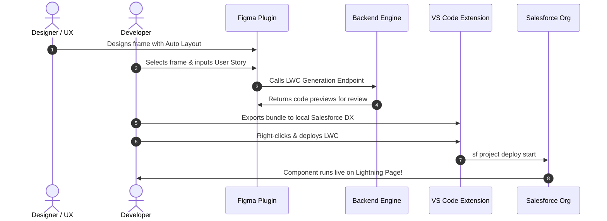

# Figma to Salesforce LWC Accelerator - Real-World Developer Guide

This guide explains the end-to-end workflow of converting a Figma user interface design and a product user story into a functional, reviewable Salesforce Lightning Web Component (LWC) matching Lightning Design System (SLDS) standards.

---

## The End-to-End Workflow



---

## Step 1: Figma Canvas Best Practices

To obtain clean SLDS structures and high-confidence semantic mappings, follow these canvas naming guidelines:

1. **Auto Layout**: Always wrap groups in Horizontal or Vertical Auto Layout. The normalizer maps Horizontal Auto Layout to `<div class="slds-grid slds-gutters">` and Vertical Auto Layout to scoped column CSS class structures.
2. **Layer Naming Conventions**:
   - **Cards**: Name wrapper frames starting with `Card`, e.g., `Card / Account Health`.
   - **Buttons**: Name button elements starting with `Button`, e.g., `Button / Primary` or `Button / Neutral`.
   - **Inputs**: Name inputs starting with `Input` or `Field`, e.g., `Input / Account Name`.
   - **Badges/Pills**: Name status pills starting with `Badge` or `Pill`, e.g., `Badge / Active Status`.
   - **Headings**: Use text nodes named `Title`, `Heading`, or set font weight to $\ge 700$.

---

## Step 2: Formulating Functional User Stories

The **Blueprint Compiler** parses your user stories and acceptance criteria for triggers to generate active JS properties and event handlers:

| Trigger Keyword                         | Generated Output                | Resulting Behavior                                                                            |
| --------------------------------------- | ------------------------------- | --------------------------------------------------------------------------------------------- |
| `record id`, `record page`              | `@api recordId;`                | Automatically hooks LWC context to the current record page ID.                                |
| `toast`, `success notification`         | `import { ShowToastEvent } ...` | Binds a platform toast notification event callback to button `onclick` handlers.              |
| `apex`, `server`, `controller`          | `import getApexData from ...`   | Imports a server-side Apex class controller reference.                                        |
| Input layer names (e.g. `Account Name`) | `accountNameValue = '';`        | Generates a reactive track state property, input value binding, and input `onchange` handler. |

### Sample Production User Story

```text
Title: Update Customer Details Card
Description: As a customer representative, I want to edit customer information directly on the Account record page.
Acceptance Criteria:
- Display input fields for "Customer Phone" and "Customer Email".
- When clicking the "Save Details" button, trigger a success toast notification.
- Load context using the record ID.
```

---

## Step 3: Local VS Code Export

Once you have the Figma selection JSON and user story, use the VS Code extension to write the bundle:

1. Copy the JSON from the Figma plugin UI (tab **Raw JSON**).
2. Inside VS Code, open the Command Palette (`Cmd+Shift+P` on Mac, `Ctrl+Shift+P` on Windows).
3. Select **Figma to LWC: Generate Component from JSON**.
4. Choose **Paste JSON from Clipboard**.
5. Input parameters:
   - **Component Name**: `customerDetailsCard`
   - **Target Page**: `lightning__RecordPage`
   - **API Version**: `61.0`
6. The extension auto-detects `sfdx-project.json` and writes the component directly to:
   `force-app/main/default/lwc/customerDetailsCard/`
7. A prompt will ask if you want to open the generated files for review. Select **Open Files** to inspect.

---

## Step 4: Salesforce DX Deployment

To push your generated component to a Salesforce Scratch Org, Sandbox, or Developer Org:

1. Open your terminal in the Salesforce DX project root directory.
2. Run the Salesforce CLI deploy command:
   ```bash
   sf project deploy start --metadata LightningComponentBundle:customerDetailsCard
   ```
3. Alternatively, right-click the `customerDetailsCard` folder in the VS Code file explorer and click **SFDX: Deploy Source to Org**.

---

## Step 5: Post-Generation Developer QA Checklist

Before committing or pushing LWC code to production, review the following:

- [ ] **Warnings Check**: Inspect the generated `README.md` file for any classification or mapping warnings (e.g., icons mapped to utility placeholders).
- [ ] **Data Binding**: If wiring actual Salesforce schema fields, import fields from `@salesforce/schema/Account.FieldName` and swap the input values with `lightning-record-edit-form` where appropriate.
- [ ] **Apex Stubs**: If the blueprint generated server-side imports (e.g., `import getApexData from '@salesforce/apex/UpdateCustomerDetailsCardController.getData'`), create the matching Apex Controller class in your project.
- [ ] **Test Coverage**: Run `npm run test:unit` inside your Salesforce DX project to ensure Jest tests assert HTML rendering and lifecycle events.
